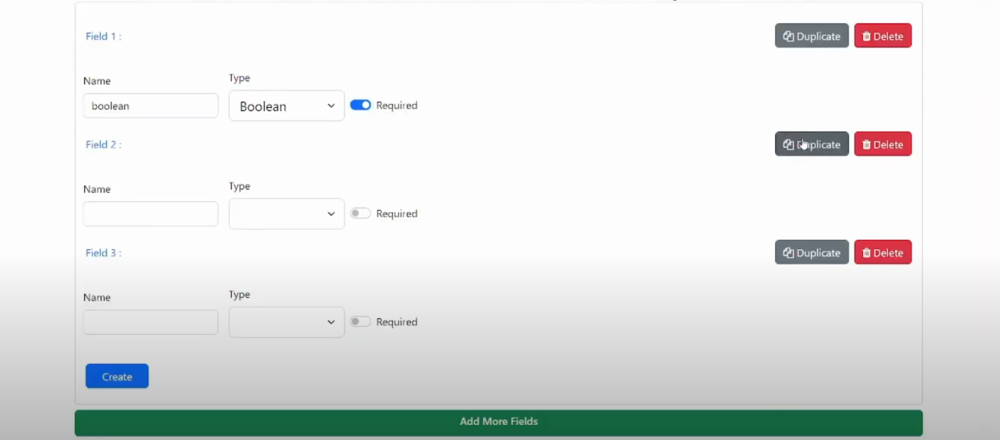

# QuestionnaireHub

Website: [Demo](https://drive.google.com/file/d/1m_sGgb2u2OTTWi36jmhCvxO1C4sdWHmS/view?usp=sharing)

[QuestionnaireHub] is an application to create and build questionnaire.

## Start project 
=> npm install

## Start front server 
=> ng serve

## Start json server 
=> npm run server

## Add a Survey to an Angular Application
1) Npm Package
=> npm install survey-angular --save
2) Open the angular.json file in your angular project
=>{
  "$schema": "./node_modules/@angular/cli/lib/config/schema.json",
  // ...
  "projects": {
    "project-name": {
      "projectType": "application",
      // ...
      "architect": {
        "build": {
          // ...
          "options": {
            // ...
            "styles": [
              "src/styles.css",
              // Default V2 theme
              "node_modules/survey-angular/defaultV2.min.css",
              // Modern theme
              // "node_modules/survey-angular/modern.min.css"
            ],
            // ...
          }
        }
      }
    }
  }
}
3)Full documentation => https://surveyjs.io/form-library/documentation/get-started-angular